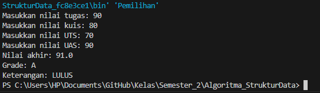
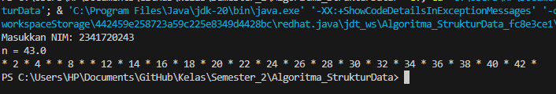
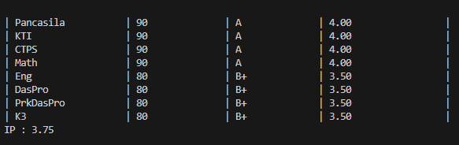
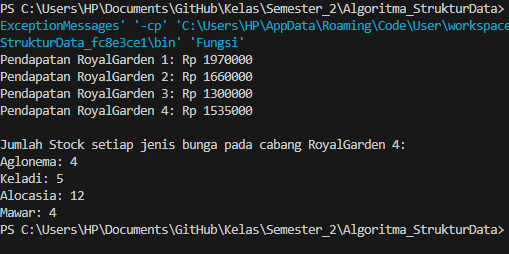
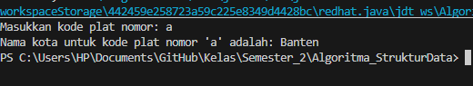
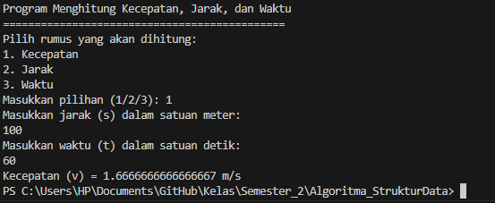
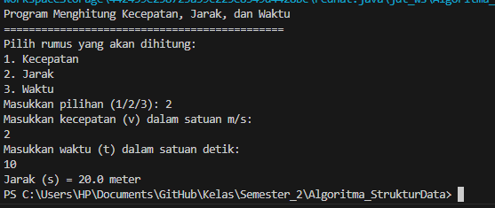
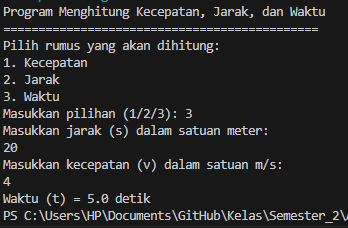

# Laporan Jobsheet Praktikum Pertemuan 1

## Pemilihan
Hasil Output dari Kode Program Pemilihan

## Perulangan
Hasil Output dari Kode Program Perulangan

## Array
Hasil Output dari Kode Program Array

## Fungsi
Hasil Output dari Kode Program Fungsi

## Tugas 1
Hasil Output dari Kode Program Plat Mobil

## Tugas 2
Hasil Output dari Kode Program Keceaptan Jarak Waktu

### Kecepatan

### Jarak

### Waktu

