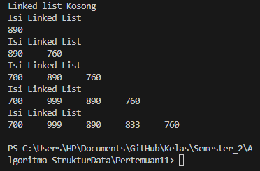
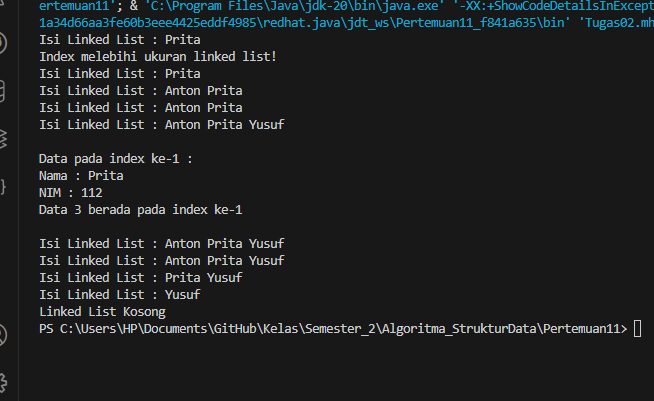

# Praktikum 10 Linked List
* Nama  : Varizky Naldiba Rimra
* Kelas : TI - 1H

## 2.1 Pembuatan Single Linked List
### 2.1.1 Verifikasi Hasil Percobaan

### 2.1.2 Pertanyaan
1. Mengapa hasil compile kode program di baris pertama menghasilkan “Linked List Kosong”?
> Karena tidak ada nilai pada list tersebut alias kosong
2. Jelaskan kegunaan variable temp secara umum pada setiap method!
> `temp`/ temporary digunakan untuk menunjukkan node sementara 
3. Perhatikan class SingleLinkedList, pada method insertAt Jelaskan kegunaan kode berikut

> kode tersebut digunakan untuk mengecek apakah node yang akan ditambahkan merupakan node terakhir. Dan jika iya, tail akan diubah jadi node baru

## 2.2 Modifikasi Elemen pada Single Linked List
### 2.2.1 Verifikasi Hasil Percobaan

### 2.2.2 Pertanyaan
1. Mengapa digunakan keyword break pada fungsi remove? Jelaskan!
> Fungsi remove digunakan untuk menghapus node pada linked list, sehingga kita tidak perlu melakukan perulangan setelah node tersebut dihapus. Menggunakan keyword break pada fungsi remove membuat program langsung keluar dari perulangan dan tidak melakukan perulangan yang tidak diperlukan.
2. Jelaskan kegunaan kode dibawah pada method remove

> Kode tersebut digunakan untuk menghapus node yang sesuai dengan key dengan melewatkan node yang ingin dihapus dan mengubah referensi node sebelumnya (temp) untuk menunjuk ke node setelah node yang dihapus.

## 3. Tugas
1. Implementasikan ilustrasi Linked List Berikut. Gunakan 4 macam penambahan data yang telah
dipelajari sebelumnya untuk menginputkan data.

> 
2. Buatlah implementasi program antrian layanan unit kemahasiswaan sesuai dengan kondisi yang
ditunjukkan pada soal nomor 1! Ketentuan
a. Implementasi antrian menggunakan Queue berbasis Linked List!
b. Program merupakan proyek baru, bukan modifikasi dari soal nomor 1!
> 