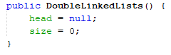
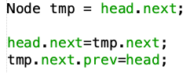

# Pertemuan 13 Double Linked Lists
Nama  : Varizky Naldiba Rimra
Kelas : TI - 1H
## Praktikum 1
### Verifikasi Hasil 
- 
### Pertanyaan
1. Jelaskan perbedaan antara single linked list dengan double linked lists!
* Single Linked List:
   - Setiap node hanya memiliki satu referensi ke node berikutnya.
   - Membutuhkan lebih sedikit ruang di memori karena hanya menyimpan satu referensi.
   - Operasi traversal mundur tidak mungkin dilakukan secara efisien.

* Double Linked List:
   - Setiap node memiliki dua referensi, satu ke node sebelumnya dan satu ke node berikutnya.
   - Memungkinkan operasi traversal mundur dengan mudah.
   - Membutuhkan lebih banyak ruang di memori karena menyimpan dua referensi.
   
2. Perhatikan class Node, di dalamnya terdapat atribut next dan prev. Untuk apakah atribut tersebut?
> Atribut next dan prev pada class Node digunakan untuk menyimpan referensi ke node berikutnya (next) dan node sebelumnya (prev), yang memungkinkan operasi traversal maju dan mundur pada linked list.

3. Perhatikan konstruktor pada class DoubleLinkedLists. Apa kegunaan inisialisasi atribut head dan size seperti pada gambar berikut ini? 
- 
> Inisialisasi head = null dan size == 1 digunakan untuk menandakan bahwa linked list awalnya kosong (head = null) dan memiliki ukuran awal 1 (size = 1).

4. Pada method `addFirst()`, kenapa dalam pembuatan object dari konstruktor class Node prev dianggap sama dengan null?
`Node newNode = new Node(null, item, head);`
> untuk menjadikan data terpenuhi sebagai `addFirst` tentu tidak ada nilai sebelumnya maka dianggap null, karna jika ada nilai sebelum `addFirst` maka tidak lagi disebut `addFirst` , tapi addSecond hehe:)

5. Perhatikan pada method `addFirst()`. Apakah arti statement head.prev = newNode ?
> Pernyataan head.prev = newNode dalam metode addFirst() berarti node sebelumnya dari node head saat ini diatur menjadi node baru.

6. Perhatikan isi method addLast(), apa arti dari pembuatan object Node dengan mengisikan parameter prev dengan current, dan next dengan null?
`Node newNode = new Node(current, item, null);`
> Mengisi parameter prev dengan current dan next dengan null memiliki arti bahwa node baru yang dibuat akan memiliki reference ke node sebelumnya yang saat ini merupakan node current, dan tidak memiliki reference ke node berikutnya.

7. Pada method add(), terdapat potongan kode program sebagai berikut:
- 
- jelaskan maksud dari bagian yang ditandai dengan kotak kuning.
> Node sebelumnya dari node current adalah null (artinya current adalah head), maka buatlah node baru dengan item sebagai datanya, prev diatur sebagai null, dan next diarahkan ke node current. Selanjutnya, atur node sebelumnya dari node current yaitu prev menjadi node baru yang telah dibuat. Terakhir, atur head sebagai node baru tersebut.

## Praktikum 2
### Verifikasi hasil
- 
### Pertanyaan
1. Apakah maksud statement berikut pada method removeFirst()?
```java
head = head.next;
head.prev = null;
```
> Pada statement `head = head.next;` digunakan untuk memindahkan head ke next dan pada statement `head.prev = null;` digunakan untuk memastikan bahwa nilai sebelum node baru tidak ada alias null(memastikan bahwa node baru adalah yang pertama, bukan second choice :) ) 

2. Bagaimana cara mendeteksi posisi data ada pada bagian akhir pada method removeLast()?
> yang pertama dicek adalah apakah data lebih dari 1, jika iya maka data akan di cek dengan kode program 
```java
Node current = head;
        while (current.next.next != null) {
            current = current.next;
        }
```
jika sudah memenuhi maka pointer sudah berada pada bagian akhir

3. Jelaskan alasan potongan kode program di bawah ini tidak cocok untuk perintah remove!
- 
> Potongan kode program tersebut tidak cocok untuk perintah remove karena node yang dihapus tidak memiliki penyesuaian pada pointer sebelum dan sesudahnya. Pada operasi remove, perlu dilakukan penyesuaian pointer prev dan next dari node sebelum dan sesudah node yang dihapus agar linked list tetap terhubung dengan benar.

4. Jelaskan fungsi kode program berikut ini pada fungsi remove!
- 
> Untuk menghapus node dari linked list

## Praktikum 3
### Verifikasi Hasil

### Pertanyaan 
1. Jelaskan method size() pada class DoubleLinkedLists!
> Method size() digunakan untuk mengembalikan jumlah node dalam DoubleLinkedLists.
 
2. Jelaskan cara mengatur indeks pada double linked lists supaya dapat dimulai dari indeks ke- 1!
> Untuk mengatur indeks pada double linked lists agar dapat dimulai dari indeks ke-1, kita dapat menggunakan indeksasi dimulai dari 1(kan harusnya dari 0 kalau tanpa indeksasi ).
Sebagai contoh, kita dapat mengakses node pertama dengan indeks 1, node kedua dengan indeks 2, dan seterusnya.
Hal ini mempermudah pemahaman dan pengaksesan data dalam double linked lists.

3. Jelaskan perbedaan karakteristik fungsi Add pada Double Linked Lists dan Single Linked Lists!
> Perbedaan karakteristik fungsi Add pada Double Linked Lists dan Single Linked Lists adalah sebagai berikut:
* Pada Double Linked Lists, penambahan node dapat dilakukan di depan (head) atau belakang (tail) dari linked list, sedangkan pada Single Linked Lists, penambahan node hanya dapat dilakukan di depan (head).
* Fungsi Add pada Double Linked Lists memerlukan penyesuaian pointer prev dan next dari node sebelum dan sesudah node yang ditambahkan, sedangkan pada Single Linked Lists, penambahan node hanya memerlukan penyesuaian pointer next dari node sebelumnya.
* Struktur Double Linked Lists memuat dua pointer, yaitu prev dan next, yang memungkinkan traversal maju dan mundur, sedangkan Single Linked Lists hanya memiliki pointer next untuk traversal maju.

4. Perbedaan logika dari kedua kode program di bawah ini adalah sebagai berikut:
1. 
2. 
> Perbedaan antara kedua kode program adalah pada bagian yang mencari node. Kode program pertama menggunakan loop while untuk mencari node dengan item yang diberikan sebagai parameter. Sedangkan kode program kedua menggunakan loop while dan if else untuk mencari node dengan item yang diberikan sebagai parameter.

## 4. Tugas Praktikum

1. Buat program antrian vaksinasi menggunakan queue berbasis double linked list sesuai ilustrasi dan menu di bawah ini!(counter jumlah antrian tersisa di menu cetak(3) dan data orang yang telah divaksinasi di menu Hapus Data(2) harus ada)
> Verifikasi Hasil
* 
2. Buatlah program daftar film yang terdiri dari id, judul dan rating menggunakan double linked lists, bentuk program memiliki fitur pencarian melalui ID Film dan pengurutan Rating secara descending. Class Film wajib diimplementasikan dalam soal ini.
> Verifikasi Hasil
* 
