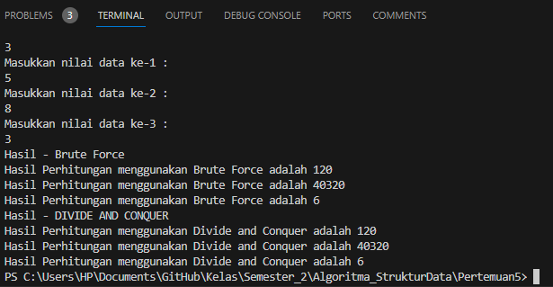

# JOBSHEET IV BRUTE FORCE DAN DIVIDE CONQUER
Nama = Varizky Naldiba Rimra
Kelas  = TI - 1H
## 4.2 Menghitung Nilai Faktorial dengan Algoritma Brute Force dan Divide and Conquer

### 4.2.3 Pertanyaan
1. Pada base line Algoritma Divide Conquer untuk melakukan pencarian nilai faktorial, jelaskan
perbedaan bagian kode pada penggunaan if dan else!
> perbedaan utama antara bagian kode yang menggunakan if dan else terjadi di dalam fungsi FaktorialDC(int n), Penggunaan 'if' Pada bagian ini, kita mengecek apakah nilai n sama dengan 1. Jika ya, maka kita langsung mengembalikan nilai 1 karena faktorial dari 1 adalah 1. Sedangkan Penggunaan 'else' Jika nilai n tidak sama dengan 1, maka kita akan melanjutkan proses perhitungan faktorial dengan menggunakan pendekatan Divide and Conquer.

2. Apakah memungkinkan perulangan pada method faktorialBF() dirubah selain menggunakan
for?Buktikan!
> Ya, memungkinkan untuk mengimplementasikan metode FaktorialBF() tanpa menggunakan perulangan for, bisa dengan menggunakan rekursif seperti berikut 
```
static int FaktorialBF(int n) {
    if (n == 0 || n == 1) {
        return 1;
    } else {
        return n * FaktorialBF(n - 1);
    }
}
```
3. Jelaskan perbedaan antara fakto *= i; dan int fakto = n * faktorialDC(n-1); !
> "fakto *= i" menggunakan metode Brute force yang dimana pada setiap iterasi, i bertambah satu dan fakto terus diperbarui dengan perkalian nilai sebelumnya dengan i sedangkan "int fakto = n * faktorialDC(n-1);" menggunakan Divede Conquer yang dimana pendekatan ini memecah masalah faktorial menjadi masalah yang lebih kecil dengan mengalikan n dengan faktorial dari n-1, dan terus berlanjut hingga mencapai kondisi dasar saat n adalah 1.

## 4.3 Menghitung Hasil Pangkat dengan Algoritma Brute Force dan Divide and Conquer

### 4.3.3 Pertanyaan
1. Jelaskan mengenai perbedaan 2 method yang dibuat yaitu PangkatBF() dan PangkatDC()!
> Pada pangkatBF setiap iterasi, basis a dikalikan dengan dirinya sendiri, sehingga mencapai hasil pangkat akhir setelah iterasi selesai sedanngkan pangkatDC membagi pangkat menjadi dua bagian yang sama besar, menghitung hasil pangkat setengahnya secara rekursif, dan menggabungkan hasilnya.

2. Apakah tahap combine sudah termasuk dalam kode tersebut?Tunjukkan!
```
public static int PangkatDC(int a, int n) {
        if (n == 0) { 
            return 1;
        } else {
            int hasilPangkatSetengah = PangkatDC(a, n / 2);
            if (n % 2 == 1) {
                return hasilPangkatSetengah * hasilPangkatSetengah * a;
            } else {
                return hasilPangkatSetengah * hasilPangkatSetengah;
            }
        }
    }
```
3. Modifikasi kode program tersebut, anggap proses pengisian atribut dilakukan dengan
konstruktor.
```
package Minggu5;

import java.util.Scanner;

public class Pangkat {
    public int nilai, pangkat;

    // Constructor
    public Pangkat(int nilai, int pangkat) {
        this.nilai = nilai;
        this.pangkat = pangkat;
    }

    public static int PangkatBF(int a, int n) {
        int hasil = 1; 
        for (int i = 0; i < n; i++) {
            hasil *= a;
        }
        return hasil;
    }

    public static int PangkatDC(int a, int n) {
        if (n == 0) { 
            return 1;
        } else {
            int hasilPangkatSetengah = PangkatDC(a, n / 2);
            if (n % 2 == 1) {
                return hasilPangkatSetengah * hasilPangkatSetengah * a;
            } else {
                return hasilPangkatSetengah * hasilPangkatSetengah;
            }
        }
    }

    // Main Pangkat
    public static void main(String[] args) {
        Scanner sc = new Scanner(System.in);
        System.out.println("=================");
        System.out.println("Masukkan Jumlah Elemen yang di hitung : ");
        int Elemen = sc.nextInt();

        Pangkat[] png = new Pangkat[Elemen];
        for (int i = 0; i < Elemen; i++) {
            System.out.println("Masukkan nilai yang hendak di pangkatkan : ");
            int nilai = sc.nextInt();          
            System.out.println("Masukkan nilai Pangkat : ");
            int pangkat = sc.nextInt(); 
            png[i] = new Pangkat(nilai, pangkat);
        }

        System.out.println("HASIL PANGKAT- BRUTE FORCE");
        for (int i = 0; i < Elemen; i++) {
            int hasilBF = Pangkat.PangkatBF(png[i].nilai, png[i].pangkat);
            System.out.println("Hasil dari " + png[i].nilai + " pangkat " + png[i].pangkat + " adalah " + hasilBF);
        }

        System.out.println("HASIL PANGKAT DIVIDE AND CONQUER");
        for (int i = 0; i < Elemen; i++) {
            int hasilDC = Pangkat.PangkatDC(png[i].nilai, png[i].pangkat);
            System.out.println("Hasil dari " + png[i].nilai + " pangkat " + png[i].pangkat + " adalah " + hasilDC);
        }
        sc.close();
    }
}
```
4. Tambahkan menu agar salah satu method yang terpilih saja yang akan dijalankan menggunakan
switch-case!
```
System.out.println("Pilih metode perhitungan pangkat:");
        System.out.println("1. Brute Force");
        System.out.println("2. Divide and Conquer");
        System.out.println("Masukkan pilihan Anda (1/2): ");
        int pilihan = sc.nextInt();

        switch (pilihan) {
            case 1:
                System.out.println("HASIL PANGKAT- BRUTE FORCE");
                for (int i = 0; i < Elemen; i++) {
                    int hasilBF = Pangkat.PangkatBF(png[i].nilai, png[i].pangkat);
                    System.out.println("Hasil dari " + png[i].nilai + " pangkat " + png[i].pangkat + " adalah " + hasilBF);
                }
                break;
            case 2:
                System.out.println("HASIL PANGKAT DIVIDE AND CONQUER");
                for (int i = 0; i < Elemen; i++) {
                    int hasilDC = Pangkat.PangkatDC(png[i].nilai, png[i].pangkat);
                    System.out.println("Hasil dari " + png[i].nilai + " pangkat " + png[i].pangkat + " adalah " + hasilDC);
                }
                break;
            default:
                System.out.println("Pilihan tidak valid.");
        }
```

## 4.4 Menghitung Sum Array dengan Algoritma Brute Force dan Divide and Conquer

### 4.4.3 Pertanyaan
1. Mengapa terdapat formulasi return value berikut?Jelaskan!

> Formulasi return value digunakan untuk menghitung total keuntungan perusahaan selama periode tertentu dengan menggunakan algoritma Divide and Conquer.
2. Kenapa dibutuhkan variable mid pada method TotalDC()?
> Untuk membagi sub-masalah menjadi dua bagian yang sama besar
3. Program perhitungan keuntungan suatu perusahaan ini hanya untuk satu perusahaan saja.
Bagaimana cara menghitung sekaligus keuntungan beberapa bulan untuk beberapa
perusahaan.(Setiap perusahaan bisa saja memiliki jumlah bulan berbeda-beda)? Buktikan
dengan program!


## 4.5 Latihan Praktikum
1. Sebuah showroom memiliki daftar mobil dengan data sesuai tabel di bawah ini

Tentukan:
> A. top_acceleration tertinggi menggunakan Divide and Conquer!
> B. top_acceleration terendah menggunakan Divide and Conquer!
> C. Rata-rata top_power dari seluruh mobil menggunakan Brute Force!
##### Hasil Output
