# Jobsheet VI Searching
- Nama    : Varizky Naldiba Rimra
- Kelas   : TI - 1H

## 6.2 Searching / Pencarian Menggunakan Agoritma Sequential Search

### Hasil Verifikasi Sequential Search

- Data Keseluruhan
> 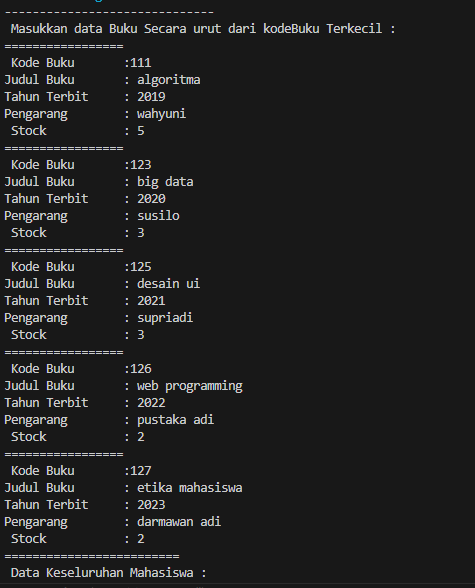
-  Pencarian Data Ditemukan
> 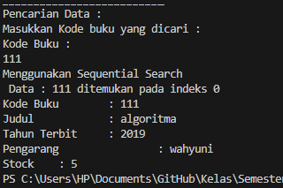
- Pencarian Data tidak ditemukan
> 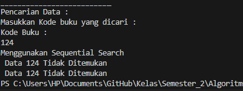

#### 6.2.3. Pertanyaan
1. Jelaskan fungsi break yang ada pada method FindSeqSearch!
> untuk menghentikan perulangan for jika data yang dicari sudah ditemukan
2. Jika Data Kode Buku yang dimasukkan tidak terurut dari kecil ke besar. Apakah program masih dapat berjalan? Apakah hasil yang dikeluarkan benar? Tunjukkan hasil screenshoot untuk bukti dengan kode Buku yang acak. Jelaskan Mengapa hal tersebut bisa terjadi?
> 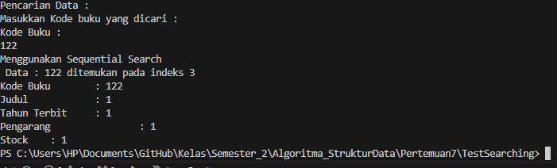
- kode program masih bisa berjalan, akan tetapi data yang di 'searching' merupakan data yang teracak, karena data yang tersusun atau teracak     tidak mempengaruhi kode program. 
3. Buat method baru dengan nama FindBuku menggunakan konsep sequential search dengan tipe method dari FindBuku adalah BukuNoAbsen. Sehingga Anda bisa memanggil method tersebut pada class BukuMain seperti gambar berikut :
> 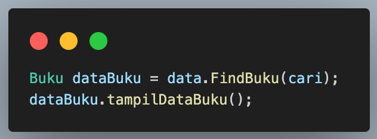
- Method FindBuku
```
 Buku FindBuku(int cari) {
        for (int j = 0; j < listBK.length; j++) {
            if (listBK[j].kodeBuku == cari) {
                return listBK[j]; 
            }
        }
        return null;
    }
```
## 6.3 Searching / Pencarian Menggunakan Binary Search

### Hasil Verifikasi Binary Search
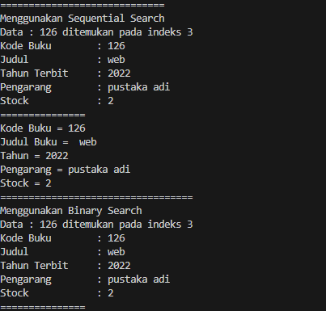

#### Pertanyaan 
1. Tunjukkan pada kode program yang mana proses divide dijalankan!
```
mid = left + (right - left) / 2;
```
2. Tunjukkan pada kode program yang mana proses conquer dijalankan!
```
else if (listBK[mid].kodeBuku > cari) {
    return FindBinarySearch(cari, left, mid - 1);
} else {
    return FindBinarySearch(cari, mid + 1, right);
}

```
3. Jika data Kode Buku yang dimasukkan tidak urut. Apakah program masih dapat berjalan? Mengapa demikian! Tunjukkan hasil screenshoot untuk bukti dengan kode Buku yang acak. Jelaskan Mengapa hal tersebut bisa terjadi?
> Data teracak
- 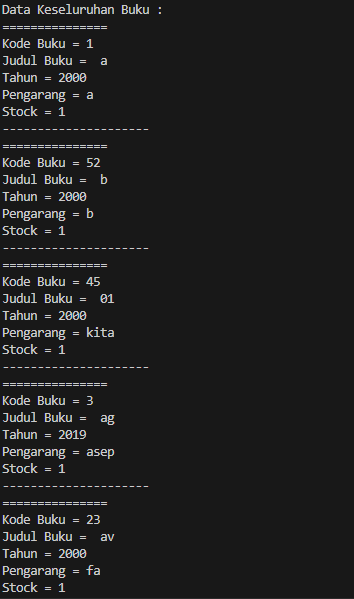
> Hasil
- 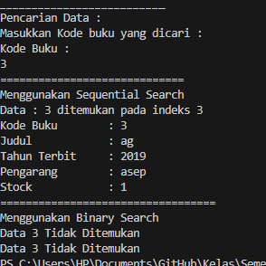
> Dalam contoh tersebut, meskipun data kode buku tidak diurutkan, pencarian menggunakan sequential search masih berhasil menemukan data yang dicari. Namun, pencarian menggunakan binary search tidak berhasil karena algoritma tersebut mengasumsikan data yang diurutkan. Karena itu, hasil pencarian menggunakan binary search tidak akurat.

4. Jika Kode Buku yang dimasukkan dari Kode Buku terbesar ke terkecil (missal : 20215, 20214, 20212, 20211, 20210) dan elemen yang dicari adalah 20210. Bagaimana hasil dari binary search? Apakah sesuai? Jika tidak sesuai maka ubahlah kode program binary seach agar hasilnya sesuai!
```
int FindBinarySearch(int cari, int left, int right) {
    int mid;
    if (right >= left) {
        mid = left + (right - left) / 2;
        if (cari == listBK[mid].kodeBuku) {
            return mid;
        } else if (cari < listBK[mid].kodeBuku) {
            return FindBinarySearch(cari, mid + 1, right);
        } else {
            return FindBinarySearch(cari, left, mid - 1);
        }
    }
    return -1;
}
```

## 6.4. Percobaan Pengayaan Divide and Conquer

### Hasil Verifikasi
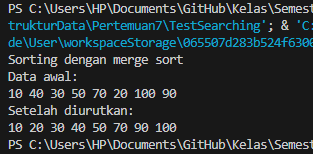

## 6.5. Latihan Praktikum
1. Modifikasi percobaan searching diatas dengan ketentuan berikut ini
- Ubah tipe data dari kode Buku yang awalnya int menjadi String
- Tambahkan method untuk pencarian kode Buku (bertipe data String) dengan menggunakan sequential search dan binary search.
- Sequential 
```
int FindSeqSearchKode(String cari) {
        int posisi = -1;
        for (int j = 0; j < listBK.length; j++) {
            if (listBK[j] != null && listBK[j].kodeBuku.equals(cari)) {
                posisi = j;
                break;
            }
        }
        return posisi;
    }
```
- Binary
```
int FindBinarySearchKode(String cari, int left, int right) {
        int mid;
        if (right >= left) {
            mid = left + (right - left) / 2;
            if (cari.equals(listBK[mid].kodeBuku)) {
                return mid;
            } else if (cari.compareTo(listBK[mid].kodeBuku) < 0) {
                return FindBinarySearchKode(cari, left, mid - 1);
            } else {
                return FindBinarySearchKode(cari, mid + 1, right);
            }
        }
        return -1;
    }
```
2.  Modifikasi percobaan searching diatas dengan ketentuan berikut ini
- Tambahkan method pencarian judul buku menggunakan sequential search dan binary search. Sebelum dilakukan searching dengan binary search data harus dilakukan pengurutan dengan menggunakan algoritma Sorting (bebas pilih algoritma sorting apapun)! Sehingga ketika input data acak, maka algoritma searching akan tetap berjalan
- SeqSearchJudul
```
 int FindSeqSearchJudul(String cari) {
        int count = 0;
        for (int j = 0; j < listBK.length; j++) {
            if (listBK[j] != null && listBK[j].judulBuku.equals(cari)) {
                count++;
            }
        }
        return count;
    }
```
- BinSearchJudul
```
int FindBinarySearchJudul(String cari, int left, int right) {
        int mid;
        if (right >= left) {
            mid = left + (right - left) / 2;
            if (cari.equals(listBK[mid].judulBuku)) {
                return mid;
            } else if (cari.compareTo(listBK[mid].judulBuku) < 0) {
                return FindBinarySearchJudul(cari, left, mid - 1);
            } else {
                return FindBinarySearchJudul(cari, mid + 1, right);
            }
        }
        return
}
```
- Buat aturan untuk mendeteksi hasil pencarian judul buku yang lebih dari 1 hasil dalam bentuk kalimat peringatan! Pastikan algoritma yang diterapkan sesuai dengan kasus yang diberikan!

### Hasil Latihan Pratikum
- Data 
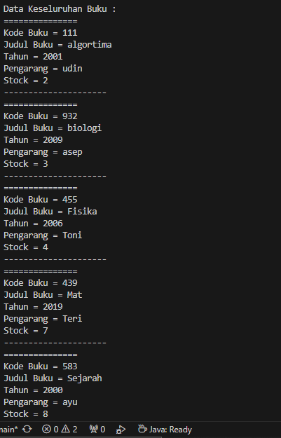
- Search
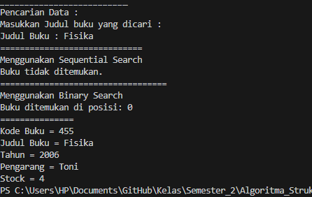