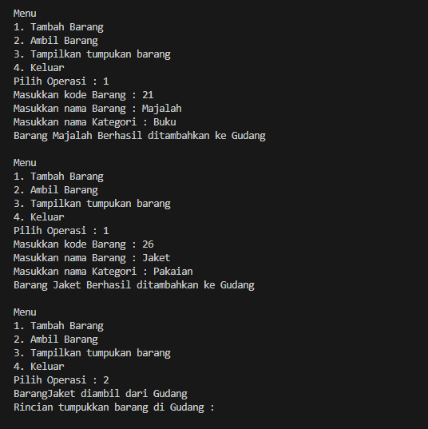
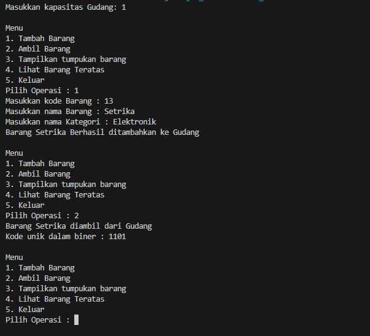
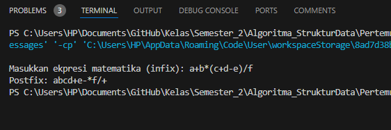
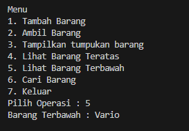
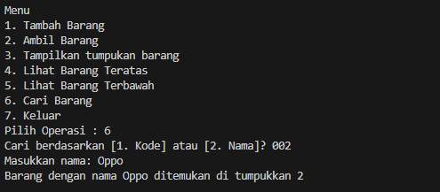

# Stacking

## 2.1 Percobaan 1: Penyimpanan Tumpukan Barang dalam Gudang
### 2.1.2 Verifikasi Hasil 

### 2.1.3 Pertanyaan
1. Lakukan perbaikan pada kode program, sehingga keluaran yang dihasilkan sama dengan verifikasi hasil percobaan! Bagian mana saja yang perlu diperbaiki?
> mengubah logika for pada method Tampildata();
```
for (int i = top; i >= 0; i--)
```
2. Berapa banyak data barang yang dapat ditampung di dalam tumpukan? Tunjukkan potongan kode programnya!
banyak data 
```
Gudang28 gudang = new Gudang28(7);
```
3. Mengapa perlu pengecekan kondisi !cekKosong() pada method tampilkanBarang? Kalau kondisi tersebut dihapus, apa dampaknya?
> Pengecekan kondisi !cekKosong() pada method tampilkanBarang() dilakukan untuk memastikan bahwa sebelum melakukan iterasi untuk menampilkan barang-barang di gudang, ada barang yang tersedia. Ini penting karena jika gudang kosong (tidak ada barang), maka tidak perlu melakukan iterasi karena tidak ada yang akan ditampilkan.
4. Modifikasi kode program pada class Utama sehingga pengguna juga dapat memilih operasi lihat barang teratas, serta dapat secara bebas menentukan kapasitas gudang!
```java
import java.util.Scanner;


public class Utama28 {
    public static void main(String[] args) {
        Scanner scanner = new Scanner(System.in);

        System.out.print("Masukkan kapasitas Gudang: ");
        int kapasitas = scanner.nextInt();
        scanner.nextLine();
        
        Gudang28 gudang = new Gudang28(kapasitas);

        while (true) {
            System.out.println("\nMenu");
            System.out.println("1. Tambah Barang");
            System.out.println("2. Ambil Barang ");
            System.out.println("3. Tampilkan tumpukan barang ");
            System.out.println("4. Lihat Barang Teratas");
            System.out.println("5. Keluar");
            System.out.print("Pilih Operasi : ");
            int pilihan = scanner.nextInt();
            scanner.nextLine(); 

            switch (pilihan) {
                case 1:
                    System.out.print("Masukkan kode Barang : ");
                    int kode = scanner.nextInt();
                    scanner.nextLine();
                    System.out.print("Masukkan nama Barang : ");
                    String nama = scanner.nextLine();
                    System.out.print("Masukkan nama Kategori : ");
                    String kategori = scanner.nextLine();
                    Barang28 barangBaru = new Barang28(kode, nama, kategori);
                    gudang.tambahBarang(barangBaru);
                    break;
                case 2:
                    gudang.ambilBarang();
                    break;
                case 3:
                    gudang.tampilkanBarang();
                    break;
                case 4:
                    gudang.lihatBarangTeratas();
                    break;
                case 5:
                    System.exit(0);
                    break;
                default:
                    System.out.println("Pilihan Tidak Valid, Coba Lagi");
            }
        }
    }
}

```
5. Commit dan push kode program ke Github

## 2.2 Percobaan 2: Konversi Kode Barang ke Biner
### Verifikasi Hasil

### 2.2.3 Pertanyaan 
1. Pada method konversiDesimalKeBiner, ubah kondisi perulangan menjadi while (kode != 0), bagaimana hasilnya? Jelaskan alasannya!
```java
public String konversiDesimalKeBiner(int kode) {
    String hasil = "";
    while (kode != 0) {
        int sisa = kode % 2;
        hasil = sisa + hasil;
        kode = kode / 2;
    }
    return hasil;
}

```
> dengan menggunakan while (kode != 0), kita memastikan bahwa konversi dilakukan hingga bilangan desimal menjadi 0, yang sesuai dengan algoritma konversi desimal ke biner yang benar.

2. Jelaskan alur kerja dari method konversiDesimalKeBiner!
> setiap iterasi akan membagi bilangan desimal (kode) dengan 2 dan menyimpan sisa bagi tersebut sebagai bit biner. Proses ini terus berlanjut sampai bilangan desimal menjadi 0. Setelah itu, bit-binernya akan dikembalikan dalam bentuk string sebagai hasil konversi.

## 2.3 Percobaan 3: Konversi Notasi Infix ke Postfix
### Verifikasi Hasil

### 2.3.3 Pertanyaan
1. Pada method derajat, mengapa return value beberapa case bernilai sama? Apabila return value diubah dengan nilai berbeda-beda setiap case-nya, apa yang terjadi?
> Jika nilai kembalian dalam metode derajat diubah untuk memberikan nilai yang berbeda untuk setiap operator, maka prioritas operator dalam konversi ekspresi infix ke postfix akan diubah.
2. Jelaskan alur kerja method konversi!
- Iterasi melalui setiap karakter dalam ekspresi infix.
- Jika karakter adalah operand, tambahkan ke ekspresi postfix.
- Jika karakter adalah tanda kurung buka, masukkan ke dalam stack.
- Jika karakter adalah tanda kurung tutup, keluarkan operator dari stack dan tambahkan ke ekspresi postfix hingga menemukan tanda kurung buka yang sesuai.
- Jika karakter adalah operator, keluarkan operator dari stack dan tambahkan ke ekspresi postfix jika operator di atas stack memiliki prioritas yang sama atau lebih tinggi.
- Masukkan operator saat ini ke dalam stack.
- Kembalikan ekspresi postfix yang telah dibentuk.
3. Pada method konversi, apa fungsi dari potongan kode berikut?
> Potongan kode ini berfungsi untuk menangani karakter tanda kurung buka '(' dalam ekspresi infix. Ketika karakter saat ini dalam iterasi adalah tanda kurung buka, kode ini memanggil metode push(c) untuk memasukkan karakter '(' ke dalam stack.
## 2.4 Latihan Praktikum
* Perhatikan dan gunakan kembali kode program pada Percobaan 1. Tambahkan dua method berikut pada class Gudang:
1.  Method lihatBarangTerbawah digunakan untuk mengecek barang pada tumpukan terbawah



2.  Method cariBarang digunakan untuk mencari ada atau tidaknya barang berdasarkan kode barangnya atau nama barangnya
