# Pertemuan 6
Nama    : Varizky Naldiba Rimra
Kelas   : TI - 1H
NIM     : 2341720343

## 5.2 Mengurutkan Data Mahasiswa Berdasarkan IPK Menggunakan Bubble Sort
### 5.2.2 Verifikasi Hasil Percobaan
Sebelum Sorting
>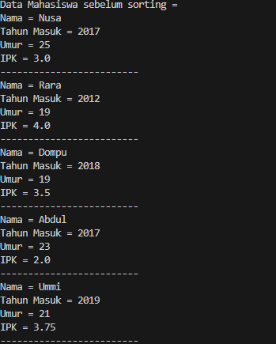

Setelah Sorting
>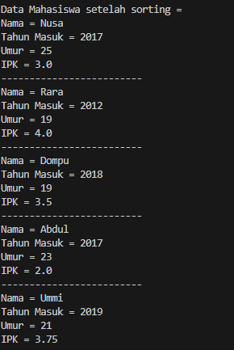

### 5.2.3 Pertanyaan
1. Terdapat di method apakah proses bubble sort?
> void bubbleSort()
2. Di dalam method bubbleSort(), terdapat baris program seperti di bawah ini:
Untuk apakah proses tersebut?
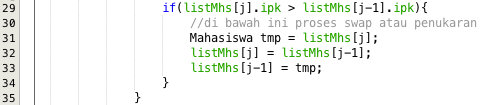
> untuk melakukan pertukran indeks ke variable sementara 'temp' jika nilai ipk  ke-[j] > ipk ke-[j-1]
3. Perhatikan perulangan di dalam bubbleSort() di bawah ini:
> 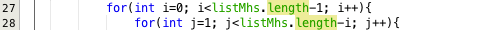
- a. Apakah perbedaan antara kegunaan perulangan i dan perulangan j?
> Pada perulangan i digunakan untuk menentukan awal dan akhir elemen yang akan di eksekusi sedangkan perulangan j berfungsi untuk membandingkan antar 2 elemen yg berdekatan dan menukar sekaligus menempatkan ke variabel sementara 'temp'
- b. Mengapa syarat dari perulangan i adalah i<listMhs.length-1 ?
>  karena pada algoritma bubble sort membutuhkan beberapa iterasi dalam mengurutkan elemen dan akan membubble ke urutan yg benar
- c. Mengapa syarat dari perulangan j adalah j<listMhs.length-i ?
> Karena bubble short mengurutkan dari yang belum terurut dan jika tersisa 1 angka yg belum di urutkan, otomatis angka itu adalah angka yang paling besar(ascendant) atau kecil (descendant)
- d. Jika banyak data di dalam listMhs adalah 50, maka berapakali perulangan i akan berlangsung? Dan ada berapa Tahap bubble sort yang ditempuh?
> sebanyak 49 kali perulangan

## 5.3 Mengurutkan Data Mahasiswa Berdasarkan IPK Menggunakan Selection Sort
### 5.3.2 Verifikasi Hasil Percobaan
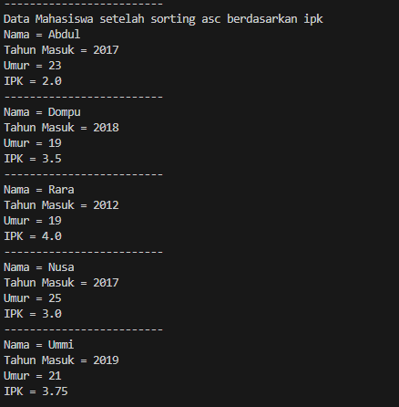
#### 5.3.3 Pertanyaan
1. Di dalam method selection sort, terdapat baris program seperti di bawah ini:
> 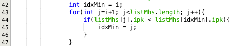
- Untuk apakah proses tersebut, jelaskan!
> untuk mengurutkan listMhs dari terkecil jadi idxmin berfungsi menyimpan elemen i, lalu di setiap perulangan akan di lakukan j=i+1 agar tidak terjadi perulangan yang sama, dan jika memenuhi syarat if nya maka idxmin akan di replace dengan j

## 5.4 Mengurutkan Data Mahasiswa Berdasarkan IPK Menggunakan Insertion Sort
### 5.4.2 Verifikasi Hasil Percobaan
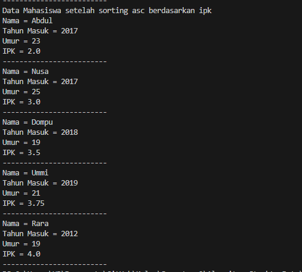
#### 5.4.3 Pertanyaan
1. Ubahlah fungsi pada InsertionSort sehingga fungsi ini dapat melaksanakan proses sorting dengan cara descending
```
void insertionSort() {
        for (int i = 1; i < listMhs.length; i++) { 
            Mahasiswa temp = listMhs[i];
            int j = i;
            while (j > 0 && listMhs[j - 1].ipk < temp.ipk) { 
                listMhs[j] = listMhs[j - 1];
                j--;
            }
            listMhs[j] = temp;
        }
    }
```

## Latihan Praktikum
Sebuah platform travel yang menyediakan layanan pemesanan kebutuhan travelling sedang mengembangkan backend untuk sistem pemesanan/reservasi akomodasi (penginapan), salah satu fiturnya adalah menampilkan daftar penginapan yang tersedia berdasarkan pilihan filter yang diinginkan user. Daftar penginapan ini harus dapat disorting berdasarkan
1. Harga dimulai dari harga termurah ke harga tertinggi.
2. Rating bintang penginapan dari bintang tertinggi (5) ke terendah (1)
Buatlah proses sorting data untuk kedua filter tersebut dengan menggunakan algoritma bubble sort dan selection sort.
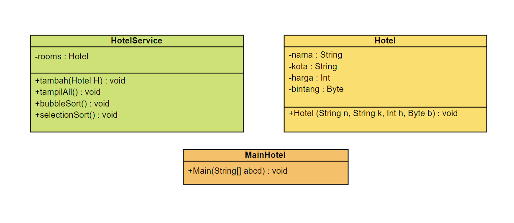

- Berikut Hasil Outputnya
> 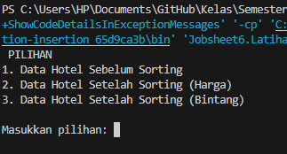
- Sebelum Sorting
>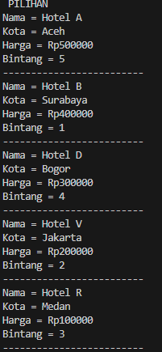
- Sorting Harga
>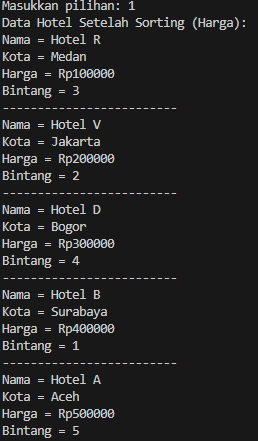
- osrting Bintang
>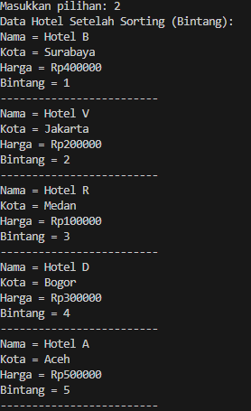